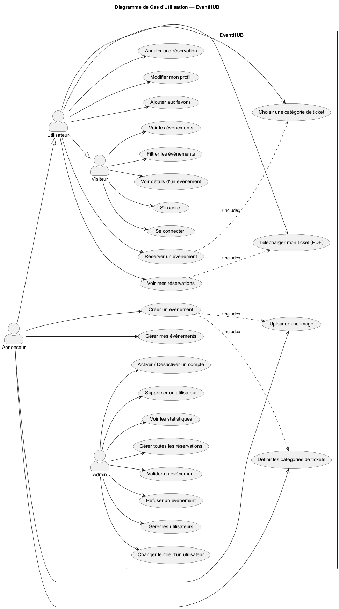
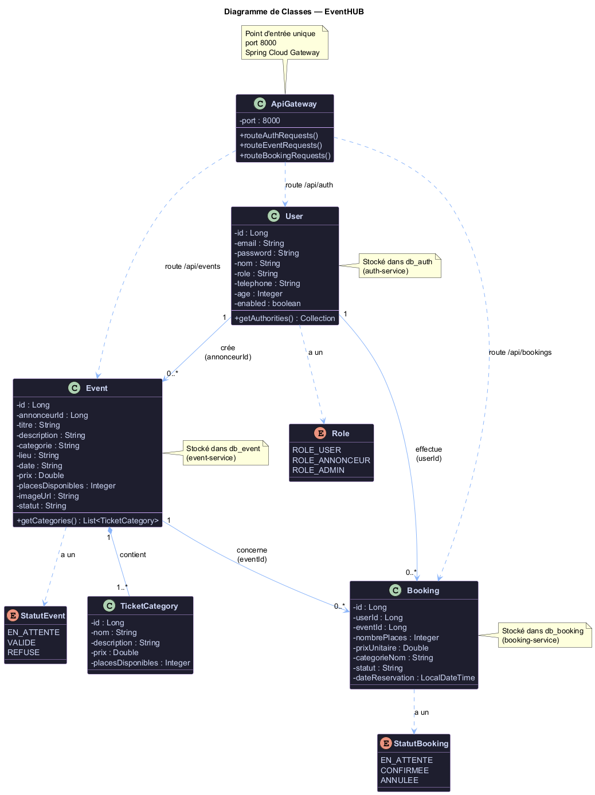

# EventHUB — Plateforme de Réservation d'Événements

> Projet DevOps — ENSIAS 2A · Équipe AHI · 2025–2026

---

## Table des matières

1. [Équipe](#-équipe)
2. [Introduction](#-introduction)
3. [Choix technologiques](#-choix-technologiques)
4. [Architecture](#-architecture)
5. [Sécurité](#-sécurité)
6. [APIs](#-apis)
7. [Tests unitaires](#-tests-unitaires)
8. [CI/CD Pipeline](#-cicd-pipeline)
9. [Infrastructure & Déploiement](#-infrastructure--déploiement)
10. [Monitoring](#-monitoring)
11. [Défis rencontrés](#-défis-rencontrés)

---

## 👥 Équipe

Projet réalisé par l'équipe **AHI** dans le cadre du cours DevOps — ENSIAS 2A 2025–2026

| Membre | GitHub |
|--------|--------|
| Anas El Midaoui | [@anasmidaoui](https://github.com/anasmidaoui) |
| Hafsa Hounaoui | — |
| Ihssan Ben Labsir | — |

---

## 📌 Introduction

**EventHUB** est une plateforme de billetterie en ligne construite selon une architecture **microservices**. Elle permet aux utilisateurs de découvrir des événements culturels, de réserver des billets, et de télécharger un **billet PDF avec QR code**. Les annonceurs peuvent publier et gérer leurs événements, et les administrateurs valident les publications avant qu'elles soient visibles.

Le projet couvre l'ensemble du cycle DevOps : développement, tests unitaires, intégration continue, conteneurisation Docker, orchestration Kubernetes, et Infrastructure as Code avec Terraform.

### Acteurs et rôles

| Acteur | Rôle |
|--------|------|
| **Client** | Consulter les événements, réserver des billets, télécharger son billet PDF |
| **Annonceur** | Créer et gérer ses événements, uploader des images |
| **Administrateur** | Valider ou refuser les événements, gérer les utilisateurs |

---

## 🛠 Choix technologiques

| Couche | Technologie | Justification |
|--------|-------------|---------------|
| Frontend | React 18, Vite 5, Tailwind CSS | SPA moderne, build optimisé, style rapide |
| Backend | Java 17, Spring Boot 3.2 | Standard entreprise, ecosystème riche |
| API Gateway | Spring Cloud Gateway | Routage centralisé, CORS unifié |
| Communication inter-services | OpenFeign | Appels HTTP déclaratifs entre microservices |
| Sécurité | Spring Security, JWT (JJWT 0.12.6), BCrypt | Authentification stateless, mots de passe hashés |
| Persistance | Spring Data JPA, Hibernate, MySQL 8 | ORM mature, requêtes sécurisées |
| Génération PDF | OpenPDF + ZXing | Billets PDF avec QR code unique |
| Conteneurisation | Docker, Docker Compose | Portabilité, isolation des services |
| Orchestration | Kubernetes (Minikube) | Auto-healing, scaling, déploiement déclaratif |
| Infrastructure as Code | Terraform | Infrastructure versionnée, reproductible |
| CI/CD | GitHub Actions | Automatisation tests + build + push Docker Hub |
| Monitoring | Prometheus, Grafana, Loki, Promtail, Zipkin | Métriques, logs centralisés, traces distribuées |
| Tests | JUnit 5, Mockito, Spring MockMvc | Tests unitaires et tests de contrôleurs |

---

## 🏗 Architecture

### Structure du projet

```
development-platform-ahi_team/
├── backend/
│   ├── api-gateway/         # Point d'entrée unique — Spring Cloud Gateway (port 8000)
│   ├── auth-service/        # Authentification & utilisateurs (port 8081)
│   ├── event-service/       # Gestion des événements + upload images (port 8082)
│   └── booking-service/     # Réservations + génération PDF/QR (port 8083)
├── frontend/                # Application React (Nginx en production)
├── eventhub-infrastructure/
│   ├── docker-compose.yml   # Lancement complet en local
│   ├── k8s/                 # Manifestes Kubernetes (8 fichiers YAML)
│   └── terraform/           # Infrastructure as Code (11 fichiers .tf)
├── docs/
│   ├── use-case.puml        # Diagramme use-case PlantUML
│   └── class-diagram.puml   # Diagramme de classes PlantUML
└── .github/workflows/
    └── ci-cd.yml            # Pipeline GitHub Actions
```

### Flux de communication

```
Navigateur (localhost:5173)
        │
        ▼
  [Frontend React / Nginx]
        │  appels HTTP /api/*
        ▼
  [API Gateway :8000]  ←── point d'entrée unique, gère CORS
        │
        ├──► /api/auth/**       ──► [Auth Service    :8081] ──► db_auth
        ├──► /api/events/**     ──► [Event Service   :8082] ──► db_event
        ├──► /api/bookings/**   ──► [Booking Service :8083] ──► db_booking
        └──► /api/admin/**      ──► service concerné
                                          │
                               [Booking] appelle [Event]
                               via Feign pour décrémenter
                               les places après confirmation
```

### Diagrammes

<div align="center">

| Diagramme de cas d'utilisation | Diagramme de classes |
|:---:|:---:|
|  |  |

</div>

### Design Patterns appliqués

- **Repository Pattern** : `JpaRepository` pour chaque entité
- **DTO Pattern** : `AuthResponse`, `RegisterRequest`, `UpdateProfileRequest`
- **Facade Pattern** : API Gateway comme point d'entrée unique
- **SOLID** : chaque microservice a une responsabilité unique

---

## 🔐 Sécurité

- **Mots de passe** : hashés avec **BCrypt** (jamais stockés en clair)
- **Authentification** : **JWT** généré à la connexion, contient l'ID utilisateur et son rôle
- **JwtFilter** : chaque service (auth, event, booking) vérifie le token JWT indépendamment sur chaque requête
- **Autorisation** : `hasAuthority("ROLE_ADMIN")` sur les routes `/api/admin/**`
- **CORS** : configuré de façon centralisée dans l'API Gateway
- **Secrets Kubernetes** : mots de passe et clé JWT stockés dans un `Secret` K8s, jamais en clair dans le code
- **Requêtes paramétrées** : Spring Data JPA protège contre les injections SQL

### Rôles utilisateurs

| Rôle | Token JWT |
|------|-----------|
| `ROLE_CLIENT` | Réserver des billets, voir ses réservations |
| `ROLE_ANNONCEUR` | Créer et gérer ses événements |
| `ROLE_ADMIN` | Accès à toutes les routes `/api/admin/**` |

---

## 📡 APIs

### Auth Service — `/api/auth`

| Méthode | Endpoint | Description |
|---------|----------|-------------|
| POST | `/api/auth/register` | Créer un compte |
| POST | `/api/auth/login` | Connexion → retourne JWT |
| GET | `/api/auth/users/{id}` | Profil d'un utilisateur |
| PUT | `/api/auth/users/{id}/profile` | Modifier nom, téléphone, mot de passe |

```json
POST /api/auth/login
{ "email": "anas@eventhub.com", "password": "monMotDePasse" }

→ { "token": "eyJ...", "userId": 1, "nom": "Anas", "role": "ROLE_CLIENT" }
```

### Event Service — `/api/events`

| Méthode | Endpoint | Description |
|---------|----------|-------------|
| GET | `/api/events` | Événements VALIDES et futurs uniquement |
| GET | `/api/events/{id}` | Détail d'un événement |
| GET | `/api/events/annonceur/{id}` | Événements d'un annonceur |
| POST | `/api/events` | Créer un événement (statut EN_ATTENTE) |
| PUT | `/api/events/{id}/decrement?count=N` | Réduire les places disponibles |
| DELETE | `/api/events/{id}` | Supprimer un événement |
| POST | `/api/upload/image` | Upload d'image (multipart) |

### Booking Service — `/api/bookings`

| Méthode | Endpoint | Description |
|---------|----------|-------------|
| POST | `/api/bookings` | Créer une réservation (EN_ATTENTE_PAIEMENT) |
| GET | `/api/bookings/user/{userId}` | Réservations d'un utilisateur |
| GET | `/api/bookings/event/{eventId}` | Réservations d'un événement |
| PUT | `/api/bookings/{id}/confirmer` | Confirmer → CONFIRMEE + décrémente places |
| PUT | `/api/bookings/{id}/annuler` | Annuler → ANNULEE |
| GET | `/api/bookings/{id}/ticket` | Télécharger le billet en PDF avec QR code |

**Flux de confirmation :**
1. `PUT /confirmer` → statut CONFIRMEE sauvegardé en base
2. Appel Feign vers Event Service : `PUT /api/events/{id}/decrement`
3. Si Event Service tombe → la réservation reste CONFIRMEE (non bloquant)

---

## 🧪 Tests unitaires

34 tests couvrent les 3 services backend :

| Fichier | Tests | Ce qui est testé |
|---------|-------|-----------------|
| `AuthServiceTest` | 11 | register, login, findById, updateProfile |
| `AuthControllerTest` | 8 | Endpoints HTTP, codes de retour 201/409/200/401/404 |
| `JwtServiceTest` | 5 | Génération de token, unicité, format JWT |
| `EventControllerTest` | 13 | Filtrage VALIDE+futur, create, delete, decrement |
| `BookingControllerTest` | 12 | Cycle complet réservation, Feign, annulation |

```bash
# Lancer les tests d'un service
cd backend/auth-service && mvn test
cd backend/event-service && mvn test
cd backend/booking-service && mvn test
```

---

## ⚙️ CI/CD Pipeline

Pipeline GitHub Actions déclenché à chaque push sur `main` ou `feature/anas` :

```
Push sur main
      │
      ▼
┌─────────────────────────────────────┐
│ STAGE 1 — Tests (en parallèle)      │
│  ├── Tests auth-service             │
│  ├── Tests event-service            │
│  └── Tests booking-service          │
└─────────────────────────────────────┘
      │ tous passent ?
      ▼
┌─────────────────────────────────────┐
│ STAGE 2 — Build & Push Docker Hub   │
│  ├── auth-service:latest            │
│  ├── event-service:latest           │
│  ├── booking-service:latest         │
│  ├── api-gateway:latest             │
│  └── frontend:latest                │
└─────────────────────────────────────┘
```

**Secrets GitHub requis :**

| Secret | Valeur |
|--------|--------|
| `DOCKER_USERNAME` | Nom d'utilisateur Docker Hub |
| `DOCKER_PASSWORD` | Mot de passe Docker Hub |

---

## 🚀 Infrastructure & Déploiement

### Option 1 — Docker Compose (le plus simple)

```bash
# Cloner le projet
git clone https://github.com/ENSIAS-MEH/development-platform-ahi_team.git
cd development-platform-ahi_team/eventhub-infrastructure

# Lancer tous les services (build inclus)
docker compose up --build -d

# Vérifier
docker compose ps
```

| Service | URL |
|---------|-----|
| Application | http://localhost |
| API Gateway | http://localhost:8000 |
| phpMyAdmin | http://localhost:8090 |
| Grafana | http://localhost:3000 (admin/admin) |
| Prometheus | http://localhost:9090 |
| Zipkin | http://localhost:9411 |

```bash
# Arrêter
docker compose down
```

---

### Option 2 — Kubernetes avec Terraform (IaC)

#### Prérequis
- Minikube installé et démarré
- Terraform installé

```bash
# 1. Démarrer Minikube
minikube start

# 2. Déployer avec Terraform
cd eventhub-infrastructure/terraform
terraform init
terraform apply -auto-approve

# 3. Vérifier les pods
kubectl get pods -n eventhub

# 4. Accéder à l'application (2 terminaux)
kubectl port-forward service/frontend 5173:80 -n eventhub
kubectl port-forward service/api-gateway 8000:8000 -n eventhub
```

Ouvrir **http://localhost:5173**

```bash
# Supprimer l'infrastructure
terraform destroy -auto-approve
```

#### Ressources Kubernetes créées par Terraform

| Ressource | Type | Rôle |
|-----------|------|------|
| `eventhub` | Namespace | Isolation de tous les composants |
| `eventhub-secrets` | Secret | Mot de passe MySQL + clé JWT |
| `mysql-init` | ConfigMap | Script SQL de création des bases |
| `mysql-pvc` | PersistentVolumeClaim | Stockage persistant 5Go pour MySQL |
| `mysql` | Deployment + Service (ClusterIP) | Base de données |
| `auth-service` | Deployment + Service (ClusterIP) | Authentification |
| `event-service` | Deployment + Service (ClusterIP) | Événements |
| `booking-service` | Deployment + Service (ClusterIP) | Réservations |
| `api-gateway` | Deployment + Service (NodePort 30000) | Point d'entrée |
| `frontend` | Deployment + Service (NodePort 30080) | Interface React |

---

## 📊 Monitoring

| Outil | URL | Rôle |
|-------|-----|------|
| **Prometheus** | :9090 | Collecte les métriques des services (CPU, mémoire, requêtes HTTP) |
| **Grafana** | :3000 | Dashboards visuels à partir des métriques Prometheus |
| **Loki** | :3100 | Agrégation des logs JSON de tous les services |
| **Promtail** | — | Collecte les logs Docker et les envoie à Loki |
| **Zipkin** | :9411 | Traçage distribué des requêtes entre microservices |

Chaque service Spring Boot expose `/actuator/prometheus` pour Prometheus et `/actuator/health` pour les probes Kubernetes.

---

## ⚠️ Défis rencontrés

| Défi | Solution |
|------|----------|
| **CORS entre frontend et backend** | Centralisation du CORS dans l'API Gateway avec `DedupeResponseHeader` pour éviter les doublons |
| **Ordre de démarrage dans K8s** | `readinessProbe` sur `/actuator/health` — K8s n'envoie du trafic qu'aux pods prêts |
| **Données persistantes MySQL dans K8s** | `PersistentVolumeClaim` de 5Go — les données survivent aux redémarrages des pods |
| **Secrets sensibles dans Git** | Utilisation des `Secret` Kubernetes et des `Secrets` GitHub Actions — jamais de mot de passe dans le code |
| **Quota d'artifacts GitHub épuisé** | Suppression des étapes `upload-artifact` du pipeline CI/CD |
| **Tests Spring MVC 6** | `orElseThrow()` propage une `ServletException` au lieu d'un status 500 — corrigé avec `assertThrows` |
| **Gros fichiers Terraform dans Git** | `.terraform/` ajouté au `.gitignore` après suppression du cache avec `git rm --cached` |
| **Feign Client et panne partielle** | Si Event Service tombe lors d'une confirmation, la réservation reste CONFIRMEE (try/catch non bloquant) |
| **Conflit Git entre membres** | Résolution manuelle des conflits, puis force push de la branche propre sur main |
